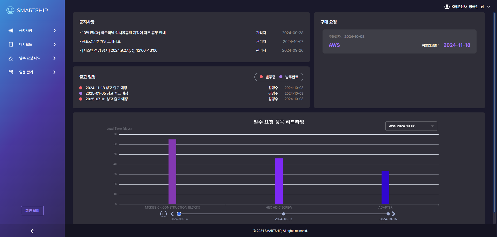

## 🚢 Smart Ship (24.08.23 - 24.10.08)
> ####  [K-Digital 부산대 24-7회차] AI 활용 빅데이터분석 풀스택웹서비스 SW 개발자 양성과정 AI 학습모델 웹서비스 개발 프로젝트
> #### 
> #### 선박, 육상, 공급업체간 기부속/선용품 공급망 관리 시스템 : Frontend:김수경, 이민주 Backend: 백이서, Data: 이지은
> - 주요 컨텐츠 : 발주 현황 조회 및 입력, 카테고리 선택을 통한 선용품 리스트 조회 및 선용품 별 각 운영체 예상 리드타임 제공, 발주 스케줄링
> - [PPT 보러가기](https://drive.google.com/drive/folders/181qhWvnSFXNsuSuq5NQo1-OnPdIUN6et?usp=sharing)

 

## :wrench: 개발 환경
>`React(18.2.0)`
`Java(17.0.10)`
`JDK(17.0.10)`
`Springboot(6.1.11)`
`MySQL(8.0.37)`

 

## :bulb: 주요 기능
 ### 01. 로그인 (공통)
 > 
- Request에서 클라이언트로부터 `username`, `password`를 받아 데이터베이스에서 사용자 인증 처리

 > 
- 인증 성공 시 JWT(Json Web Token) 발급 후 클라이언트에 반환

 > 
- 로그인 성공 시, JWT를 통해 이후 모든 요청에서 인증 처리

 > 
- 로그인 실패 시, 실패 사유와 함께 에러 메시지를 반환

 

### 02. 회원가입/탈퇴 (공통)
> 
- Request에서 회원가입에 필요한 `username`, `password`를 받아 데이터베이스에 사용자 정보 저장

> 
- 비밀번호는 해시화하여 안전하게 저장 (BCrypt 등 암호화 방식 사용)

> 
- 회원가입 성공 시, 클라이언트에 성공 메시지 반환

> 
- 회원 탈퇴 시 `enabled` 필드를 `false`로 설정하여 계정 비활성화 처리

> 
- 회원 탈퇴 요청 후 클라이언트에 성공 메시지 및 로그아웃 처리

 

### 03. 공지사항 (공급업체 사용자)
> 
- 공지사항 조회 가능

 

### 04. 물품리스트 (선박사용자 / 공급업체 사용자)
> 
- 서버에서 카테고리별로 물품을 필터링하여 조회하는 API 제공

> 
- 물품 CRUD(Create, Read, Update, Delete) 처리 로직 구현

> 
- 물품 삭제 시, 관련된 리드타임 데이터도 연관된 테이블에서 삭제 처리

 

### 05. 장바구니 (선박사용자)
> 
- 장바구니에 물품 추가 시, Request로 물품 ID와 수량을 전송하여 서버에서 처리

> 
- 장바구니 데이터는 사용자별로 데이터베이스에 저장 및 관리

> 
- 장바구니 내 물품 수정 및 삭제 기능 구현 (데이터 무결성 유지)

 

### 06. 주문내역 (선박사용자)
> 
- 사용자가 주문한 내역을 데이터베이스에서 조회하는 API 제공

> 
- 주문 상태에 따라 주문 데이터를 `ready`, `progressing`, `complete` 상태로 구분하여 관리

> 
- 주문 상세 정보에서 리드타임 정보와 함께 조회하여 관련 데이터를 반환

> 
- 주문 수정 시 트랜잭션 처리로 데이터의 일관성을 유지

 

### 07. 일정관리 (해운선사 사용자)
> 
- 발주 일정 관리를 위해 리드타임 및 주문 데이터를 기반으로 서버에서 발주 일정을 계산

> 
- Request에서 발주 정보와 리드타임 데이터를 받아 서버에서 일정 데이터를 처리

 

### 08. 구매요청 (해운선사 사용자)
> 
- 구매 요청 시 서버로부터 Request 데이터를 받아 데이터베이스에 저장

> 
- 리드타임을 기반으로 발주 예상 날짜를 서버에서 자동 계산하여 제공

> 
- 구매 요청 내역을 DB에서 상태별로 관리 (`요청`, `진행 중`, `완료`)

> 
- 상태 업데이트 시 관련된 데이터를 실시간으로 반영하여 처리

 

### 09. 발주관리 (해운선사 사용자)
> 
- 서버에서 발주 상태를 관리하는 API 제공 (`발주 요청`, `발주 처리 완료` 등)
 
> 
- 발주된 아이템의 상태를 실시간으로 업데이트하여 DB에 저장

> 
- 트랜잭션 처리로 발주 작업 중 오류 발생 시 롤백하여 데이터 무결성 유지

> 
- 발주 관련 로그 기록을 통해 모든 발주 작업을 추적 가능하도록 구현

 

### 10. 물품관리 (공급업체 사용자)
> 
- 물품 등록, 수정, 삭제를 처리하는 API 제공 (CRUD 기능)

> 
- 물품 리드타임 정보는 서버에서 자동 계산하여 저장

> 
- 공급업체 사용자는 자신의 물품 발주 내역을 조회할 수 있는 API 제공

> 
- 물품 수정 및 삭제 시, 연관된 데이터를 함께 업데이트 및 삭제 처리

 

### 11. 대시보드 (공급업체 사용자)
> 
- 실시간으로 물품 발주 내역 및 판매 현황을 조회할 수 있는 API 제공

> 
- 공지사항, 주문 상태, 판매량 등의 데이터를 서버에서 효율적으로 조회할 수 있도록 최적화

 

### 12. 공지사항 (관리자)
> 
- 관리자는 공지사항 작성, 수정, 삭제 기능을 이용할 수 있는 API 제공

> 
- 공지사항 작성 시, 첨부 파일을 파일 서버에 저장하고 경로를 DB에 저장

> 
- 공지사항 비활성화 시, 사용자에게 보이지 않도록 처리

 

### 13. 회원관리 (관리자)
> 
- 관리자는 모든 회원 정보를 조회, 수정할 수 있는 API 제공

> 
- 회원의 활성화 상태 변경, 권한 부여, 탈퇴 처리 등의 기능 지원

> 
- JWT를 사용하여 관리자의 권한을 검증 후 접근 제어 처리
 

 

## :page_with_curl: 개발일지

| PERIOD | SUBJECT | 
| ------- | ------- |
| **2024.08.28** | ****회원 관리 시스템 시작** — 회원 가입 및 로그인 기능 개발 착수. Member 테이블 설계와 함께 Spring Security를 적용해 JWT 인증 구조 구상. **회원가입 컨트롤러와 서비스 로직 작성**. 회원 정보가 데이터베이스에 올바르게 저장되도록 기본적인 검증과 트랜잭션 적용.    주요 메서드: `joinMembers(Member member)`** | 
| **2024.08.29** | ****회원가입 및 중복 확인 기능 완성** — 회원 가입 시 아이디 중복을 확인하는 로직 개발. REST API 형식으로 `idCheck` 엔드포인트 추가. **회원가입 시 데이터베이스에 중복 아이디가 저장되지 않도록 Unique 제약 조건** 설정 및 테스트 완료.   주요 메서드: `testMembers(Member member)`** | 
| **2024.08.30** | ****회원 탈퇴 기능 추가** — 탈퇴 시 사용자 데이터를 물리적으로 삭제하지 않고, `enabled` 필드를 `false`로 설정해 비활성화하는 방식으로 처리. **회원 탈퇴 후에도 데이터를 유지**하며, 필요한 경우 복구 가능하도록 DB 설계 변경.   주요 메서드: `unsubMember(String id)`** | 
| **2024.08.31** | ****장바구니 서비스 개발 착수** — 장바구니에 아이템을 추가하는 기능 구현. Cart와 CartItem 테이블 설계 후 **장바구니 추가 API와 연동**. 사용자 인증 정보를 바탕으로 **사용자별 장바구니**가 생성되도록 구성.   주요 메서드: `addToCart(List<CartItemRequestDTO> cartItems)`** | 
| **2024.09.02** | ****장바구니 상품 삭제 기능 추가** — 사용자가 장바구니에서 특정 상품을 삭제할 수 있는 API 개발. 삭제 시 실제 데이터를 지우는 대신 **삭제 플래그를 설정**해 상품을 숨기도록 처리해 데이터의 무결성을 유지.   주요 메서드: `deleteItemsByItemId(List<Integer> itemIds)`** | 
| **2024.09.03** | ****카테고리 관리 기능 개발** — 상품을 카테고리별로 구분하기 위한 Category1, Category2, Category3 테이블 설계. 각 카테고리 간의 관계 설정 후, **카테고리 조회 API**를 개발해 프론트엔드에서 카테고리 선택 시 연동되도록 구성.   주요 메서드: `getAllCategory1()`, `getAllCategory2()`, `getAllCategory3()`** | 
| **2024.09.04** | ****카테고리 관련 기능 테스트 및 수정** — 카테고리 데이터가 올바르게 조회되고, **상품 등록 시 카테고리 선택**이 올바르게 작동하는지 테스트. 카테고리와 상품 간의 외래 키 관계 확인 후 **데이터베이스 제약 조건 보완**.   주요 메서드: `convertToCategory1DTO(Category1 category1)`, `convertToCategory2DTO(Category2 category2)`, `convertToCategory3DTO(Category3 category3)`** | 
| **2024.09.05** | ****상품 등록 및 수정 기능 개발** — 사용자가 새로운 상품을 등록하거나 기존 상품을 수정할 수 있는 기능 구현. **상품 테이블 설계** 및 데이터 검증 로직 추가. 사용자 권한에 따라 등록 가능한지 여부를 판단하도록 서비스 레이어 구성.   주요 메서드: `addItem(ItemsDTO itemsDTO, String username, Authentication authentication)`, `updateMultipleItems(List<ItemsDTO> itemsDTOList, String username)`** | 
| **2024.09.06** | ****상품 삭제 및 대체 상품 추천 기능 추가** — 상품 삭제 시 관련된 리드타임이나 장바구니 아이템도 삭제되도록 **연관 데이터 처리 로직 추가**. 삭제된 상품 대신 **대체 상품을 추천**하는 로직 구현 및 테스트 완료.   주요 메서드: `deleteItems(List<Integer> itemIds, String username)`, `getRecommendedItems(Integer selectItemId, LocalDate releaseDate, Integer orderId)`** | 
| **2024.09.09** | ****공지사항 기능 개발 시작** — 관리자만 공지사항을 등록할 수 있도록 권한을 설정하고, 공지사항 등록, 수정, 삭제 기능을 개발. **공지사항 파일 첨부 기능**을 위해 파일 업로드 서비스를 구성하고 파일 저장 경로를 설정.   주요 메서드: `createNotice(String title, String content, MultipartFile[] files, String userId, Authentication authentication)`** | 
| **2024.09.10** | ****공지사항 조회 및 권한 분리** — 관리자와 일반 사용자 간에 공지사항 조회 범위를 분리. **관리자는 모든 공지사항을 볼 수 있고**, 일반 사용자는 활성화된 공지만 볼 수 있도록 필터링 로직 작성. 주요 메서드: `getNoticesByRole(String role)`** | 
| **2024.09.11** | ****발주 및 주문 내역 관리 기능 개발** — 주문 데이터를 Orders와 OrderDetail로 나누어 설계. 사용자 주문 내역 조회, 발주 내역 관리 기능 개발. **주문 시 리드타임을 계산해 추천 발주 날짜를 설정**하는 로직 구현.   주요 메서드: `getOrderDetailsByOrderId(Integer orderId, Authentication authentication)`** | 
| **2024.09.12** | ****주문 내역 상태 관리 기능 추가** — 주문 상태를 `ready`, `progressing`, `complete`로 구분해 관리. 주문 상태에 따라 화면에 표시되는 정보가 달라지도록 DTO에 **상태 필드 추가** 후 로직 테스트 완료.   주요 메서드: `calculateOrderState(List<OrderDetail> orderDetails)`** | 
| **2024.09.13** | ****주문 내역 수정 및 발주 처리** — 발주된 주문 내역을 수정하는 기능 개발. 발주된 상품의 수량을 변경하거나 대체 상품으로 변경할 수 있도록 **OrderDetail 업데이트 기능** 구현. 발주가 완료되면 `ordering` 상태가 업데이트되도록 처리.   주요 메서드: `updateOrderDetails(List<OrderDetailUpdateDTO> updateRequests, Authentication authentication)`** | 
| **2024.09.16** | ****공급자 주문 내역 조회 기능 추가** — 공급자가 자신의 주문 내역을 조회할 수 있는 기능 개발. 공급자의 아이디를 통해 **자신의 아이템에 대한 발주 내역만 조회**하도록 엔드포인트 구성.   주요 메서드: `getSupplierOrdersGroupedByDate(Authentication authentication)`** | 
| **2024.09.23** | ****파일 서비스 개선** — 공지사항에 첨부된 파일을 다운로드할 수 있는 기능 추가. 파일 경로에 대한 보안 검토 후 **파일 접근 권한 설정**. 잘못된 파일 접근 시 예외 처리 로직 보완.   주요 메서드: `downloadFile(String fileName)`** | 
| **2024.09.25** | ****주문 상태별 통계 기능 추가** — 주문 데이터를 `progressing`, `complete` 상태별로 구분해 통계 데이터를 생성하고 관리자가 이를 볼 수 있도록 **관리자 전용 통계 API** 개발.   주요 메서드: `calculateOrderState(List<OrderDetail> orderDetails)`** | 
| **2024.09.27** | ****회원 정보 수정 기능 개선** — 회원 정보 수정 기능을 보완해 사용자가 자신의 기본 정보를 업데이트할 수 있도록 함. 사용자 이름, 전화번호, 기타 개인 정보를 수정할 수 있는 기능 개발 완료.   주요 메서드: `updateMember(Authentication authentication, String id, String username, String alias, String role, String phone, boolean enabled, String etc)`** | 
| **2024.09.30** | ****장바구니 및 주문 로직 통합** — 사용자가 장바구니에서 선택한 아이템을 주문으로 전환하는 로직을 개선하고, **장바구니 항목을 주문으로 전환할 때 수량 변경**이 잘못되는 문제 해결.   주요 메서드: `saveCartItemsToOrder(List<CartItemDTO> cartItems, LocalDate releaseDate, String memo, SelectedDay selectedDay)`** | 
| **2024.10.01** | ****공지사항 파일 업로드 기능 개선** — 공지사항을 등록할 때 파일을 첨부하여 업로드할 수 있도록 기능을 확장. 업로드된 파일의 보안성을 보장하기 위해 파일명 검증 및 **업로드 경로 보호** 기능 추가.   주요 메서드: `storeFile(MultipartFile file)`, `deleteFile(String fileName)`** | 
| **2024.10.02** | ****주문 내역 조회 성능 최적화** — 주문 내역을 조회할 때 발생하는 쿼리의 성능을 개선. **불필요한 데이터를 최소화하고** 필요한 데이터만 가져올 수 있도록 SELECT 쿼리 개선 및 인덱스 추가.   주요 메서드: `getOrdersWithDetails()`** | 
| **2024.10.03** | ****발주 내역 관리 기능 완료** — 발주 내역을 관리하고 수정할 수 있는 기능 최종 마무리. 발주 처리 시 **주문 상태가 적절히 업데이트되도록 트랜잭션 관리** 및 발주된 항목의 기록을 로그로 남기도록 구성.   주요 메서드: `updateOrderDetails(List<OrderDetailUpdateDTO> updateRequests, Authentication authentication)`, `getOrderDetailsByOrderId(Integer orderId, Authentication authentication)`** | 
| **2024.10.04** | ****상품 리드타임 데이터 업데이트** — Flask로부터 새로운 리드타임 데이터를 받아 DB에 반영하는 기능 최적화. 리드타임 예측 API를 호출하여 특정 상품의 리드타임을 업데이트하도록 로직 개선.   주요 메서드: `sendLeadtimeDataToFlask()`, `saveLeadtimeToDb(Items item, String leadtimeJson, String season, String selectedDay)`** | 
| **2024.10.05 - 10.07** | **기능 테스트 및 버그 수정** | 
